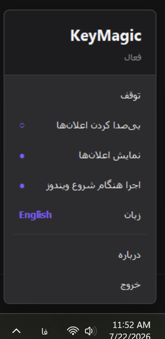
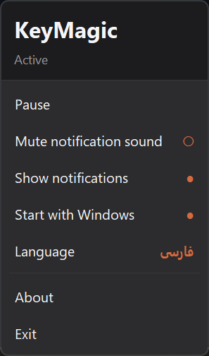
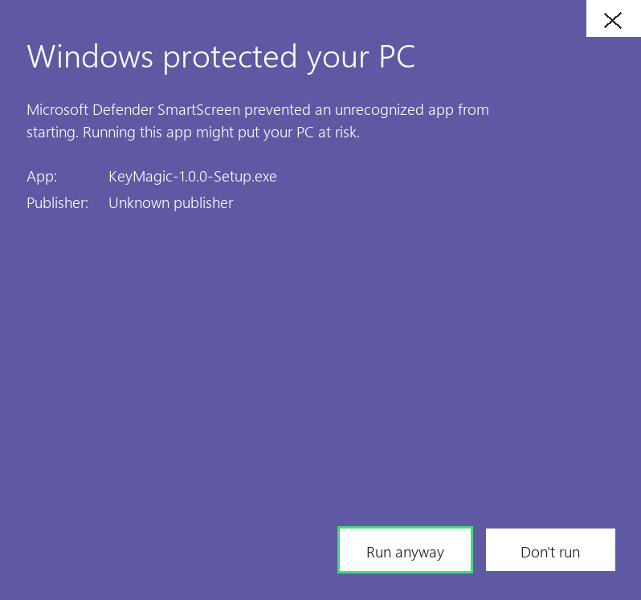
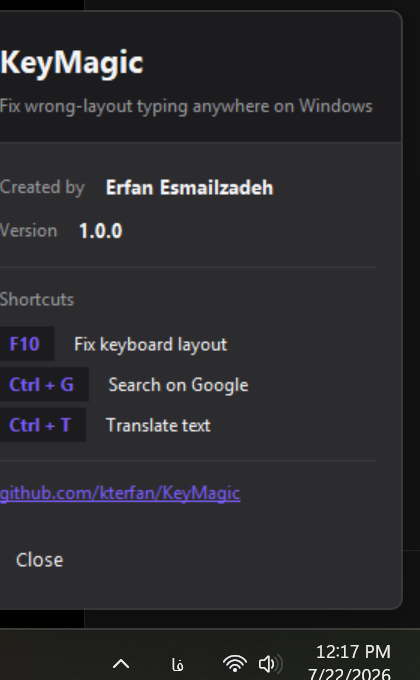

<div align="center">


# KeyMagic

**اصلاح متن تایپ‌شده با چیدمان اشتباه، در هر برنامه‌ای**
**Fix wrong-layout typing anywhere on Windows**

[](https://github.com/kterfan/KeyMagic/releases/latest)
[](https://github.com/kterfan/KeyMagic/releases)
[](LICENSE)
[](https://github.com/kterfan/KeyMagic/releases)

### [⬇️ دانلود برای ویندوز &nbsp;·&nbsp; Download for Windows](https://github.com/kterfan/KeyMagic/releases/latest)

**فارسی** &nbsp;·&nbsp; [English](#-english)

</div>

---

<div dir="rtl" align="right">

## مشکل چیست؟

شروع می‌کنید به نوشتن یک پیام فارسی، اما کیبورد هنوز روی انگلیسی است:

<div dir="ltr" align="left">

```
سلام چطوری   →   sghl ]xdvd
```

</div>

حالا باید همه‌اش را پاک کنید و از نو بنویسید. هر روز. در هر برنامه‌ای.

**KeyMagic با یک کلید درستش می‌کند.** بدون اینکه چیزی را انتخاب کنید، کلید <kbd>F10</kbd> را بزنید — متنی که همین الان نوشتید، در همان‌جا و در همان برنامه‌ای که بودید، با چیدمان درست بازنویسی می‌شود.

<div dir="ltr" align="left">

```
sghl ]xdvd   →   سلام چطوری          [F10]
lk kld n,kl  →   من نمی دونم         [F10]
```

</div>

در هر دو جهت کار می‌کند: چه فارسی که با چیدمان انگلیسی تایپ شده، چه انگلیسی که با چیدمان فارسی تایپ شده — همان یک کلید، همان نتیجه.

## سه میان‌بر

<br>

### <kbd>F10</kbd> — اصلاح چیدمان کیبورد

تنها میان‌بری که **نیازی به انتخاب متن ندارد**. اگر چیزی انتخاب نکرده باشید، KeyMagic خودش از مکان‌نما تا ابتدای خط را انتخاب می‌کند. اگر بخشی از متن را انتخاب کرده باشید، فقط همان بخش تبدیل می‌شود.

<div dir="ltr" align="left">

```
سلام دوستان چطورید      ←  [F10]  ←      sghl n,sjhk ]x,vdn
Hello my friend         ←  [F10]  ←      اثممخ ئغ بقهثدی
```

</div>

تشخیص زبان خودکار است: تعداد حروف فارسی و لاتین شمرده می‌شود و متن به سمت زبان *مقابل* تبدیل می‌شود.

<br>

### <kbd>Ctrl</kbd> + <kbd>G</kbd> — جست‌وجوی هوشمند در گوگل

متنی را در **هر برنامه‌ای** انتخاب کنید و این کلید را بزنید — مرورگر پیش‌فرضتان با نتایج جست‌وجوی گوگل برای همان متن باز می‌شود.

**چرا مفید است؟** بدون این ابزار باید: متن را انتخاب کنید ← `Ctrl+C` ← به مرورگر بروید ← تب جدید باز کنید ← `Ctrl+V` ← Enter. با KeyMagic فقط یک کلید.

مخصوصاً وقتی به‌درد می‌خورد که در جایی هستید که کپی‌کردن راحت نیست — یک PDF، یک پیام تلگرام، یک پیغام خطا در ترمینال، یا نام یک تابع در ویرایشگر کد.

<div dir="ltr" align="left">

```
"Segoe UI Variable"  →  [Ctrl+G]  →  google.com/search?q=Segoe+UI+Variable
```

</div>

متن قبل از ارسال **URL-encode** می‌شود، پس فاصله، حروف فارسی، `&`، `#` و هر نویسهٔ خاص دیگری بدون خرابی منتقل می‌شود.

<br>

### <kbd>Ctrl</kbd> + <kbd>T</kbd> — ترجمهٔ سریع

دقیقاً مثل بالا، اما به‌جای جست‌وجو، متن انتخاب‌شده را در **گوگل ترنسلیت** باز می‌کند.

زبان مبدأ روی **تشخیص خودکار** تنظیم شده (`sl=auto&tl=auto`)، پس لازم نیست بگویید متن فارسی است یا انگلیسی — خود گوگل تشخیص می‌دهد.

<div dir="ltr" align="left">

```
"ubiquitous"  →  [Ctrl+T]  →  translate.google.com/?sl=auto&tl=auto&text=ubiquitous
```

</div>

<br>

> [!IMPORTANT]
> **این سه کلید تا وقتی KeyMagic اجراست، از برنامه‌های دیگر گرفته می‌شوند.**
>
> این عمدی است و همان چیزی است که باعث می‌شود ابزار همه‌جا کار کند — اما یعنی:
>
> - <kbd>Ctrl</kbd>+<kbd>T</kbd> دیگر در مرورگر **تب جدید باز نمی‌کند**
> - <kbd>Ctrl</kbd>+<kbd>G</kbd> دیگر در ویرایشگرها **«جست‌وجوی بعدی» را اجرا نمی‌کند**
> - <kbd>F10</kbd> دیگر **نوار منو را فعال نمی‌کند**
>
> اگر این تداخل آزارتان می‌دهد، دو راه دارید: از پنل کنترل گزینهٔ **توقف** را بزنید تا موقتاً همهٔ میان‌برها آزاد شوند، یا کلیدها را در فایل [`core/config.py`](core/config.py) عوض کرده و دوباره بسازید.

## چه چیز دیگری دارد؟

- **کلیپ‌بوردتان را از بین نمی‌برد** — هر چه کپی کرده بودید، بعد از عملیات دقیقاً برمی‌گردد
- **همه‌جا کار می‌کند** — ورد، کروم، تلگرام، VS Code، ترمینال، حتی برنامه‌های با دسترسی ادمین
- **بدون پنجره** — در سینی سیستم کنار ساعت اجرا می‌شود
- **رابط کاربری دوزبانه** با راست‌چینی کامل
- **قابل بی‌صدا کردن** — اگر صدای اعلان‌ها اذیت می‌کند، خاموشش کنید

<div align="center">

&nbsp;&nbsp;

<br><em>با کلیک روی آیکون سینی سیستم باز می‌شود — در فارسی کاملاً راست‌چین می‌شود</em>
</div>

## نصب

فایل نصب را دانلود و اجرا کنید:

**[⬇️ KeyMagic-Setup.exe](https://github.com/kterfan/KeyMagic/releases/latest)** — انتخاب معمول. ویزارد دوزبانه است و در همان صفحهٔ اول زبان را می‌پرسد.

**[⬇️ KeyMagic.msi](https://github.com/kterfan/KeyMagic/releases/latest)** — برای استقرار سازمانی از طریق Group Policy یا Intune.

**پیش‌نیاز:** ویندوز ۱۰ یا ۱۱ (۶۴ بیتی). چیز دیگری لازم نیست — پایتون داخل فایل قرار دارد.

### ⚠️ ویندوز می‌گوید «Windows protected your PC» — چه کنم؟

<div align="center">

</div>

**این خطا نیست و ویروس هم نیست.** دو راه دارید:

**راه اول — سریع:** روی **Run anyway** بزنید. (اگر این دکمه را نمی‌بینید، اول **More info** را بزنید.)

**راه دوم — تمیزتر:** برچسب اینترنتی فایل را حذف کنید تا اصلاً هشدار ندهد:

> راست‌کلیک روی فایل ← **Properties** ← پایین تب General تیک **Unblock** را بزنید ← **OK**

بعد از این، فایل مثل هر برنامهٔ محلی دیگری اجرا می‌شود. با پاورشل هم می‌شود:

<div dir="ltr" align="left">

```powershell
Unblock-File .\KeyMagic-1.0.1-Setup.exe
```

</div>

**چرا این کار جواب می‌دهد؟** ویندوز به هر فایلی که از اینترنت می‌آید یک نشانهٔ نامرئی می‌چسباند (*Mark of the Web* — یک NTFS Alternate Data Stream به نام `Zone.Identifier`). SmartScreen **فقط** فایل‌هایی را که این نشانه را دارند بررسی می‌کند. `Unblock` آن نشانه را پاک می‌کند.

به همین دلیل است که اگر خودتان پروژه را با `python build.py` بسازید، هرگز این هشدار را نمی‌بینید — فایل ساخته‌شدهٔ محلی هیچ‌وقت آن برچسب را ندارد.

**چرا این پیام می‌آید؟** SmartScreen به دو چیز نگاه می‌کند و KeyMagic فعلاً هیچ‌کدام را ندارد:

| معیار | وضعیت |
|:--|:--|
| امضای دیجیتال (Code Signing) | ندارد — گواهی‌اش سالانه ۱۰۰ تا ۴۰۰ دلار هزینه دارد |
| سابقهٔ دانلود | تازه منتشر شده؛ هنوز کسی دانلود نکرده که برایش اعتبار بسازد |

هیچ‌کدام از این دو دربارهٔ سالم بودن فایل چیزی نمی‌گویند — فقط یعنی «ویندوز این فایل را نمی‌شناسد». هر چه تعداد دانلودها بیشتر شود، این هشدار خودبه‌خود کمرنگ‌تر و بعد حذف می‌شود.

**اگر می‌خواهید مطمئن شوید فایل دستکاری نشده،** چک‌سام دانلودتان را با فایل [`SHA256SUMS.txt`](https://github.com/kterfan/KeyMagic/releases/latest) مقایسه کنید:

<div dir="ltr" align="left">

```powershell
Get-FileHash KeyMagic-1.0.1-Setup.exe -Algorithm SHA256
```

</div>

**یا اصلاً به فایل من اعتماد نکنید** — کد کاملاً باز است. کلون کنید و خودتان بسازید:

<div dir="ltr" align="left">

```bash
git clone https://github.com/kterfan/KeyMagic.git && cd KeyMagic && python build.py
```

</div>

### چرا دسترسی ادمین می‌خواهد؟

ویندوز اجازه نمی‌دهد یک برنامهٔ معمولی به پنجرهٔ برنامه‌ای که با دسترسی بالاتر اجرا شده کلید بفرستد — سازوکاری امنیتی به نام **UIPI**. بدون دسترسی ادمین، KeyMagic هر وقت یک برنامهٔ ادمین (مثل خیلی از IDEها یا کنسول‌های سیستمی) فعال بود بی‌صدا کار نمی‌کرد. اجرا با دسترسی بالا همان چیزی است که «همه‌جا کار می‌کند» را واقعی می‌کند.

## تنظیمات

برای باز کردن پنل کنترل، روی آیکون سینی سیستم کلیک کنید.

| تنظیم | پیش‌فرض | توضیح |
|:--|:--|:--|
| بی‌صدا کردن اعلان‌ها | خاموش | اعلان نمایش داده می‌شود، فقط بدون صدا |
| نمایش اعلان‌ها | روشن | با خاموش کردن، اعلان‌ها کامل مخفی می‌شوند |
| اجرا هنگام شروع ویندوز | **روشن** | از داخل برنامه یا تنظیمات ویندوز قابل خاموش کردن |
| زبان | انگلیسی | کل رابط کاربری از جمله راست‌چینی را تغییر می‌دهد |

<div dir="ltr" align="left">

```
تنظیمات:  %APPDATA%\KeyMagic\settings.json
گزارش:    %LOCALAPPDATA%\KeyMagic\keymagic.log
```

</div>

## چطور کار می‌کند؟

برای اینکه چنین ابزاری واقعاً قابل‌اتکا باشد، سه مسئله باید حل شود. هر کدام پاسخ مشخصی در کد دارد.

### ۱. خواندن متن بدون شرایط رقابتی

روش ساده‌انگارانه — فرستادن <kbd>Ctrl</kbd>+<kbd>C</kbd>، کمی صبر کردن، و بعد خواندن کلیپ‌بورد — ذاتاً یک شرط رقابتی است: مدت صبر یک حدس است و هیچ تضمینی نیست که برنامهٔ مبدأ کارش را تمام کرده باشد.

KeyMagic به‌جای حدس زدن، **شمارهٔ ترتیب کلیپ‌بورد** ویندوز را قبل از کپی ثبت می‌کند و منتظر می‌ماند تا واقعاً تغییر کند. سیستم‌عامل این شمارنده را با هر تغییر کلیپ‌بورد از هر پروسه‌ای افزایش می‌دهد، پس یک سیگنال واقعی است نه یک تخمین. در پایان هم محتوای اصلی کلیپ‌بورد بازگردانده می‌شود.

← [`core/clipboard_manager.py`](core/clipboard_manager.py)

### ۲. تصاحب کلیدهای میان‌بر بدون خراب کردنشان

پیاده‌سازی اول از هوک کتابخانهٔ `keyboard` استفاده می‌کرد و به شکل ظریفی خراب بود: آن هوک برای تشخیص ترکیب‌ها مجبور است هر بار فشردن <kbd>Ctrl</kbd> را بافر کند، و همین <kbd>Ctrl</kbd>+<kbd>C</kbd> ساختگی خود برنامه را هم می‌گرفت و اجزایش را بی‌ترتیب رها می‌کرد. نتیجه اینکه پنجرهٔ مقصد یک حرف `c` خالی دریافت می‌کرد.

این خودش را به شکل تبدیل `sghl` به `سلامز` نشان داد — آن **`ز`** اضافه دقیقاً همان `c` بود که از نگاشت چیدمان رد شده بود.

راه‌حل، کنار گذاشتن کامل آن کتابخانه و استفاده از API بومی **`RegisterHotKey`** بود. سیستم‌عامل خودش ترکیب کلید را تصاحب می‌کند و پیام را به ما می‌فرستد؛ برنامهٔ فعال اصلاً کلید را نمی‌بیند و هیچ هوکی سر راه ورودی تزریق‌شده نیست. فلگ `MOD_NOREPEAT` هم تکرار خودکار کلید نگه‌داشته‌شده را در همان مبدأ غیرممکن می‌کند.

← [`core/hotkey_listener.py`](core/hotkey_listener.py)

### ۳. تایپ در برنامه‌هایی که ورودی مصنوعی را رد می‌کنند

رویدادهای کلید دستی ساخته و از طریق **`SendInput`** با کد سخت‌افزاری واقعی (`scan code`) تزریق می‌شوند — همان مسیری که یک درایور کیبورد فیزیکی تولید می‌کند. بعضی برنامه‌های سخت‌گیر این کد را بررسی می‌کنند و رویدادهایی را که فقط کد مجازی دارند دور می‌ریزند.

← [`core/input_simulator.py`](core/input_simulator.py)

### نگاشت چیدمان

یک نگاشت کامل دوطرفه بین چیدمان QWERTY آمریکایی و چیدمان استاندارد فارسی — حروف، ارقام، نشانه‌گذاری و نمادهای Shift‌دار. نگاشت بر اساس **موقعیت فیزیکی کلید** است نه معنای آن، و اصل ماجرا هم همین است: انگشتان شما روی کلیدهای درست نشستند، فقط کاراکترهای اشتباهی تولید شد.

← [`core/layout_map.py`](core/layout_map.py)

## ساخت از روی کد

<div dir="ltr" align="left">

```bash
git clone https://github.com/kterfan/KeyMagic.git
cd KeyMagic
pip install -r requirements.txt
python main.py
```

</div>

برای ساخت فایل‌های نصب:

<div dir="ltr" align="left">

```bash
python build.py
```

</div>

این دستور برنامه را با PyInstaller بسته‌بندی می‌کند، تصاویر ویزارد و ترجمهٔ فارسی را از روی کد بازتولید می‌کند، و هر دو بسته را در `dist/installer/` می‌سازد. به [Inno Setup 6](https://jrsoftware.org/isdl.php) برای EXE و [WiX Toolset v3](https://wixtoolset.org/) برای MSI نیاز دارد؛ اگر هر کدام نصب نباشد، آن مرحله با پیام واضح رد می‌شود و کل بیلد شکست نمی‌خورد.

## پرسش‌های متداول

**آیا متن من جایی فرستاده می‌شود؟**
خیر. تبدیل چیدمان یک جدول محلی است و هیچ ارتباط شبکه‌ای ندارد. تنها زمانی چیزی به اینترنت می‌رود که خودتان <kbd>Ctrl</kbd>+<kbd>G</kbd> یا <kbd>Ctrl</kbd>+<kbd>T</kbd> بزنید، که متن را دقیقاً مثل زمانی که خودتان در گوگل تایپ کنید ارسال می‌کند.

**چرا F10 کل خط را تبدیل می‌کند؟**
وقتی چیزی انتخاب نشده باشد، KeyMagic از مکان‌نما تا ابتدای خط را انتخاب می‌کند. اگر فقط بخشی را می‌خواهید، اول همان بخش را انتخاب کنید.

**یکی از میان‌برها کار نمی‌کند.**
احتمالاً برنامهٔ دیگری زودتر آن را گرفته است — `RegisterHotKey` انحصاری است و فقط یک برنامه می‌تواند هر ترکیب را داشته باشد. در فایل گزارش دنبال `Failed to register hotkey` بگردید.

**می‌توانم بدون نصب استفاده کنم؟**
بله — مخزن را کلون کنید و `python main.py` را اجرا کنید.

**آیا چیدمان‌های دیگر پشتیبانی می‌شوند؟**
فعلاً فقط انگلیسی ↔ فارسی. نگاشت در `core/layout_map.py` یک دیکشنری ساده است و اضافه کردن چیدمان جدید عمدتاً وارد کردن داده است. Pull Request پذیرفته می‌شود.

## مشارکت

Issue و Pull Request پذیرفته می‌شود. اگر باگی گزارش می‌کنید، مفیدترین چیزی که می‌توانید ضمیمه کنید فایل گزارش در `%LOCALAPPDATA%\KeyMagic\keymagic.log` است.

## مجوز

[MIT](LICENSE) © عرفان اسماعیل‌زاده

</div>

<br>

---
---

<br>

<h2 id="-english">🇬🇧 English</h2>

## The problem

You start typing a message in Persian, but the keyboard is still on English:

```
سلام چطوری   →   sghl ]xdvd
```

Now you delete it and retype the whole thing. Every day. In every app.

**KeyMagic fixes it with one key.** Select nothing, press <kbd>F10</kbd>, and the text you just typed is rewritten in the correct layout — in place, in whatever application you were already in.

```
sghl ]xdvd   →   سلام چطوری          [F10]
lk kld n,kl  →   من نمی دونم         [F10]
```

It works both ways. Persian typed on an English layout, English typed on a Persian layout — same key, same result.

## The three shortcuts

### <kbd>F10</kbd> — Smart Layout Fixer

The only shortcut that **needs no selection**. With nothing selected, KeyMagic selects from the caret back to the start of the line. If you *do* have a selection, only that is converted.

```
sghl n,sjhk ]x,vdn   →  [F10]  →   سلام دوستان چطورید
اثممخ ئغ بقهثدی      →  [F10]  →   Hello my friend
```

Language detection is automatic: it counts Persian versus Latin characters and converts toward whichever script is *not* dominant.

### <kbd>Ctrl</kbd>+<kbd>G</kbd> — Smart Search

Select text in **any application** and press this — your default browser opens with Google results for it.

**Why it helps:** without it you'd select → `Ctrl+C` → switch to the browser → open a tab → `Ctrl+V` → Enter. This is one key.

It earns its place most in the awkward spots: a PDF, a Telegram message, an error string in a terminal, a function name in your editor.

```
"Segoe UI Variable"  →  [Ctrl+G]  →  google.com/search?q=Segoe+UI+Variable
```

The text is **URL-encoded** before it's sent, so spaces, Persian characters, `&`, `#` and any other special character survive intact.

### <kbd>Ctrl</kbd>+<kbd>T</kbd> — Quick Translate

The same idea, but it opens the selection in **Google Translate** instead of Search.

The source language is set to **auto-detect** (`sl=auto&tl=auto`), so you never have to tell it whether the text is Persian or English.

```
"ubiquitous"  →  [Ctrl+T]  →  translate.google.com/?sl=auto&tl=auto&text=ubiquitous
```

> [!IMPORTANT]
> **These three keys are taken away from other applications while KeyMagic runs.**
>
> That is deliberate — it is exactly what makes the tool work everywhere — but it means:
>
> - <kbd>Ctrl</kbd>+<kbd>T</kbd> no longer **opens a new browser tab**
> - <kbd>Ctrl</kbd>+<kbd>G</kbd> no longer **runs "find next"** in editors
> - <kbd>F10</kbd> no longer **activates the menu bar**
>
> If that trade bothers you, hit **Pause** in the control panel to release every shortcut temporarily, or change the bindings in [`core/config.py`](core/config.py) and rebuild.

## What else it does

- **Never loses your clipboard** — whatever you had copied is restored afterwards
- **Works everywhere** — Word, Chrome, Telegram, VS Code, terminals, elevated apps
- **No window** — it lives in the tray, next to the clock
- **Bilingual UI** with full right-to-left mirroring
- **Mutable** — silence the notification sound if it gets old

<div align="center">

</div>

## Install

**[⬇️ KeyMagic-Setup.exe](https://github.com/kterfan/KeyMagic/releases/latest)** — the normal choice. Bilingual wizard, asks for English or Persian on the first screen.

**[⬇️ KeyMagic.msi](https://github.com/kterfan/KeyMagic/releases/latest)** — for Group Policy, Intune or SCCM.

**Requirements:** Windows 10 or 11 (64-bit). Nothing else — Python is bundled.

### ⚠️ "Windows protected your PC" — what to do

<div align="center">

</div>

**This is not an error and not a virus.** Two ways past it:

**Quickest:** click **Run anyway**. (If you don't see that button, click **More info** first.)

**Cleaner:** strip the file's internet tag so the warning never appears at all:

> Right-click the file → **Properties** → tick **Unblock** at the bottom of the General tab → **OK**

After that it runs like any local program. From PowerShell:

```powershell
Unblock-File .\KeyMagic-1.0.1-Setup.exe
```

**Why that works:** Windows attaches an invisible marker to anything downloaded from the internet — the *Mark of the Web*, an NTFS alternate data stream called `Zone.Identifier`. SmartScreen only evaluates files carrying it. `Unblock` removes the marker.

It's also why building the project yourself with `python build.py` never triggers the warning: a locally produced file never gets the tag in the first place.

**Why it appears:** SmartScreen weighs two things, and KeyMagic currently has neither.

| Signal | Status |
|:--|:--|
| Code-signing certificate | None — a certificate costs $100–400 per year |
| Download reputation | Freshly published; nobody has downloaded it yet to build any |

Neither says anything about whether the file is safe — only that Windows doesn't recognise it. The warning fades and eventually disappears on its own as downloads accumulate.

**To verify the download wasn't tampered with,** compare it against [`SHA256SUMS.txt`](https://github.com/kterfan/KeyMagic/releases/latest) in the release:

```powershell
Get-FileHash KeyMagic-1.0.1-Setup.exe -Algorithm SHA256
```

**Or don't trust my binary at all** — the source is right here. Clone it and build your own:

```bash
git clone https://github.com/kterfan/KeyMagic.git && cd KeyMagic && python build.py
```

### Why it asks for administrator

Windows blocks a normal program from sending keystrokes to a window owned by an *elevated* program — a security feature called **UIPI**. Without admin rights, KeyMagic would silently do nothing whenever an admin-level app had focus. Running elevated is what makes "works everywhere" actually true.

## Settings

Left-click the tray icon for the control panel.

| Setting | Default | Notes |
|:--|:--|:--|
| Mute notification sound | Off | Toast still appears, just silently |
| Show notifications | On | Hides the toasts entirely |
| Start with Windows | **On** | Per-user registry entry; also removable from Windows Startup Apps |
| Language | English | Switches the whole UI, including RTL layout |

```
Preferences:  %APPDATA%\KeyMagic\settings.json
Log:          %LOCALAPPDATA%\KeyMagic\keymagic.log
```

## How it works

Three problems have to be solved for a tool like this to feel reliable.

### 1. Reading the text without a race condition

The naive approach — send <kbd>Ctrl</kbd>+<kbd>C</kbd>, `sleep(0.1)`, read the clipboard — is a race by construction. The sleep is a guess, and nothing guarantees the source app finished writing.

KeyMagic reads Windows' **clipboard sequence number** before sending the copy, then polls that counter until it actually changes. The OS increments it on every clipboard write, from any process, so it is a real signal rather than a guess. Afterwards the original clipboard content is written back.

→ [`core/clipboard_manager.py`](core/clipboard_manager.py)

### 2. Claiming the hotkeys without breaking them

The first implementation used the `keyboard` library's suppression hook — and it broke things subtly. To suppress combinations, that hook must buffer every <kbd>Ctrl</kbd> press to see what follows, which also caught the synthetic <kbd>Ctrl</kbd>+<kbd>C</kbd> the app sends itself and released the pieces out of order. The target window received a bare `c` and typed a stray character into the document.

It showed up as `sghl` + <kbd>F10</kbd> producing `سلامز` — that trailing **`ز`** being exactly `c` run through the layout map.

The fix was to drop the library and use the OS-native **`RegisterHotKey`** API. Windows claims the combination itself and posts a message to us; the foreground app never sees the keystroke, and no hook sits in the path of injected input. `MOD_NOREPEAT` additionally makes held-key auto-repeat impossible at the source.

→ [`core/hotkey_listener.py`](core/hotkey_listener.py)

### 3. Typing into applications that reject synthetic input

Key events are built by hand and injected through **`SendInput`** with a real hardware scan code resolved via `MapVirtualKeyW` — the same signal path a physical keyboard driver produces. Some hardened applications inspect the scan code and discard events that carry only a virtual-key code.

→ [`core/input_simulator.py`](core/input_simulator.py)

### The layout map

A full bidirectional map between the US QWERTY layout and the standard Iranian Persian layout — letters, digits, punctuation and shifted symbols. It maps by **physical key position**, not meaning, which is the whole point: your keystrokes landed on the right keys, just produced the wrong characters.

→ [`core/layout_map.py`](core/layout_map.py)

## Build from source

```bash
git clone https://github.com/kterfan/KeyMagic.git
cd KeyMagic
pip install -r requirements.txt
python main.py
```

To produce the installers:

```bash
python build.py
```

This freezes the app with PyInstaller, regenerates the installer artwork and the Persian wizard translation from source, then compiles both packages into `dist/installer/`. Requires [Inno Setup 6](https://jrsoftware.org/isdl.php) for the EXE and [WiX Toolset v3](https://wixtoolset.org/) for the MSI; either step is skipped with a clear message if its toolchain is missing.

### Project layout

```
main.py                   entry point: elevation check, logging
build.py                  freeze → EXE installer → MSI
core/
  config.py               hotkey bindings, timings, retry counts
  settings.py             persisted preferences
  i18n.py                 English/Persian strings + RTL flag
  elevation.py            admin detection + UAC self-relaunch
  startup.py              "start with Windows" registry entry
  hotkey_listener.py      RegisterHotKey + message loop
  input_simulator.py      SendInput hardware-level key injection
  clipboard_manager.py    race-free clipboard I/O
  layout_map.py           EN↔FA key mapping, script detection
  actions.py              the three hotkey actions
  notifier.py             toasts, with mute/hide controls
  icon.py                 procedurally drawn 3D keycap icon
  flyout.py               control panel + About page
  tray.py                 system tray icon
  app.py                  wiring, pause state
installer/
  KeyMagic.iss            bilingual Inno Setup script
  KeyMagic.wxs            WiX source for the MSI
  make_wizard_art.py      generates the wizard banner
  make_persian_isl.py     generates the Persian/RTL language file
```

The icon is drawn at runtime with Pillow — a 3D extruded keycap rendered at 4× and downscaled, so there are no binary art assets to keep in sync and the paused state is just a recolor of the same geometry.

## FAQ

**Does it send my text anywhere?**
No. Layout conversion is a local lookup table with no network access at all. The only time anything leaves your machine is when *you* press <kbd>Ctrl</kbd>+<kbd>G</kbd> or <kbd>Ctrl</kbd>+<kbd>T</kbd>, which sends the selected text to Google exactly as if you had typed it there yourself.

**Why does F10 convert the whole line?**
When nothing is selected, KeyMagic selects from the caret back to the start of the line. Select a smaller range first if you want only part of it converted.

**A hotkey doesn't work.**
Another application probably claimed it first — `RegisterHotKey` is exclusive, only one program can own a given combination. Check the log for `Failed to register hotkey`.

**Can I use it without installing?**
Yes — clone the repo and run `python main.py`.

**Does it support other layouts?**
Only English ↔ Persian today. The map in `core/layout_map.py` is a plain dictionary; adding another layout is mostly data entry. PRs welcome.

## Contributing

Issues and pull requests are welcome. If you're reporting a bug, the log at `%LOCALAPPDATA%\KeyMagic\keymagic.log` is the most useful thing to attach.

## License

[MIT](LICENSE) © Erfan Esmailzadeh
